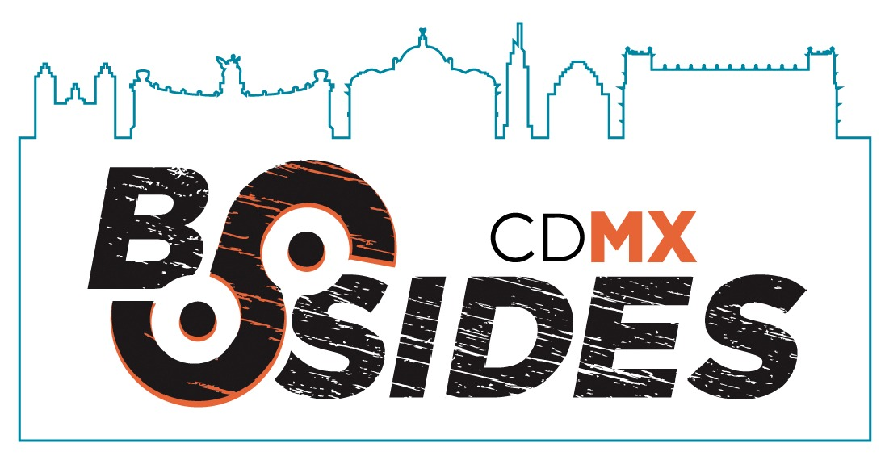

Security BSides events are hosted all over the world *"for and by information security community members."* We are happy to announce the very **1st edition** of Security BSides CDMX, the space in Mexico City where the community from around the country (and the world) is encouraged to collaborate by exchanging ideas, knowledge and experience in order to build relationship within our information security community.

This is a great opportunity for everyone to present and participate with discussions, demos, and interaction between participants. *Please, feel free to read more at* [Security BSides](http://www.securitybsides.com/w/page/12194156/FrontPage) and don't forget to follow us on [Twitter](https://twitter.com/bsidescdmx) and [Facebook](https://facebook.com/bsidescdmx).

Join us on **June 22nd, 2018**